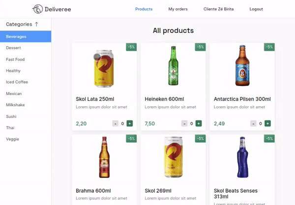

<div id="top"></div>
<!--
***
*** This readme template was inspired by: https://github.com/othneildrew/Best-README-Template/
***
-->

[![Contributors][contributors-shield]][contributors-url]
[![Forks][forks-shield]][forks-url]
[![Stargazers][stars-shield]][stars-url]
[![Issues][issues-shield]][issues-url]
[![LinkedIn][linkedin-shield]][linkedin-url]

<!-- ABOUT THE PROJECT -->
## Full Stack Delivery App using React and Express

Welcome to the _GitHub repository_ of my **Delivery App**!
Here you can find information about the project's development, such as which technologies were used, how to install and run the project, usage and more.

This full-stack application was developed during my time at [Trybe](https://www.betrybe.com/) to practice the lessons learned on both front-end and back-end modules. It was created in collaboration with group partners:

* [Enio Andrade](https://github.com/enioandrade92/)
* [Emanoel Mattos](https://github.com/manupilation/)
* [Matheus Pormanhani](https://github.com/matheuspor/)
* [João Vitor](https://github.com/joaosantosp/)


The API is a sales management system, where you can create, view, delete and update sales. Customers can add products to the cart, place an order at checkout, see all orders and mark any as "delivered". Sellers can also see all orders and mark any as "preparing" or "dispatched".

<br />

<div align="center">

  

</div>

> **P.S.:** Feel free to report any bugs or suggest ideas by creating an **Issue**, or collaborate by creating a **Pull Request** from our existing [development branch](https://github.com/pedrotrasfereti/delivery-app/pull/2)!

<br />

<!-- ACHIEVEMENTS -->

## Achievements

During the development we were able to:

* Create a RESTful Web API using **Node.js** and **Express**;
* Serve static files using Express;
* Manage a SQL database using **Sequelize**;
* Create validations for our API endpoints using **Joi**;
* Authenticate users using **JWT**;
* Create a design system from scratch using **Stitches**;
* Organize our React components into *atomic* categories (Atomic Design);
* Make requests to our API using **Axios**;
* Manage the application's state using **React-Redux**;
* Create and manage state *slices* using **Redux Toolkit**;
* Fetch and save data directly using *Toolkit's* **createAsyncThunk**;
* Use the **localStorage** Web API to persist data;

<br>

---

## Endpoints

A list of all endpoints and supported methods.

### `/register`

* **GET** - Lists all users with role "seller".
    * **Responses**:
      * `200 OK` - An array of sellers.

* **POST** - Creates a new user with role "customer".
    * **Body (required)**:
      ```
      {
        "name": "John Doe",
        "email": "johndoe@example.com",
        "password": "some_strong_password"
      }
      ```
    * **Responses**:
      * `201 Created` - The created user.
      * `409 Conflict` - "User already exists".

<br />

### `/login`

* **POST** - Creates a new user with role "customer".
    * **Body (required)**:
      ```
      {
        "email": "johndoe@example.com",
        "password": "some_strong_password"
      }
      ```
    * **Responses**:
      * `200 OK` - The user and login token.
      * `404 Not Found` - "Invalid email or password".

<br />

---

> **Note**: The following endpoints require an `Authorization` header with a valid login token as it's value; the user making the request must have the role "customer".

### `/customer/products`

* **GET** - Returns all products.
   * **Responses**:
     * `200 OK` - An array of products.
     * `401 Unauthorized` - "Token not found".

<br />

### `/customer/orders`

* **GET** - Returns all orders.
   * **Responses**:
     * `200 OK` - An array of orders.
     * `401 Unauthorized` - "Token not found".

<br />

### `/customer/orders/:id`

* **GET** - Returns a single order.
   * **Responses**:
     * `200 OK` - An order.
     * `401 Unauthorized` - "Token not found".
     * `404 Not Found` - "Order not found".

* **PATCH** - Update an existing order status.
    * **Body (required)**:
      ```
      {
        "status": "new_order_status"
      }
      ```
   * **Responses**:
     * `200 OK` - An array of orders.
     * `401 Unauthorized` - "Token not found".
     * `422 Unprocessable Entity` - "\"status\" is required" | "\"status\" must be one of [Preparando, Em Trânsito, Entregue]"

<br />

---

> **Note**: The following endpoints require an `Authorization` header with a valid login token as it's value; the user making the request must have the role "seller".

### `/seller/orders`

* **GET** - Returns all orders.
   * **Responses**:
     * `200 OK` - An array of orders.
     * `401 Unauthorized` - "Token not found".

<br />

### `/seller/orders/:id`

* **GET** - Returns a single order.
   * **Responses**:
     * `200 OK` - An order.
     * `401 Unauthorized` - "Token not found".
     * `404 Not Found` - "Order not found".

* **PATCH** - Update an existing order status.
    * **Body (required)**:
      ```
      {
        "status": "new_order_status"
      }
      ```
   * **Responses**:
     * `200 OK` - An array of orders.
     * `401 Unauthorized` - "Token not found".
     * `422 Unprocessable Entity` - "\"status\" is required" | "\"status\" must be one of [Preparando, Em Trânsito, Entregue]"

<br />

### Tables

The MySQL schema will contain four tables: **products**, **sales**, **salesproducts** and **users**.

<br />

---

### Built With

List of major frameworks/libraries used to bootstrap this project:

* [React](https://reactjs.org/)
* [React Icons](https://react-icons.github.io/react-icons/)
* [Stitches](https://stitches.dev/)
* [Redux](https://redux.js.org/)
* [Axios](https://axios-http.com/)
* [Node.js](https://nodejs.org/en/)
* [Express.js](https://expressjs.com/)
* [Chai](https://www.chaijs.com/)
* [Sinon](https://sinonjs.org/)
* [Sequelize](https://sequelize.org/)
* [MySQL](https://www.mysql.com/)
* [Joi](https://joi.dev/)
* [JWT](https://jwt.io/)

<p align="right">(<a href="#top">back to top</a>)</p>


<!-- GETTING STARTED -->
## Getting Started

To get a local copy up and running follow these simple example steps.

### Prerequisites

* npm
  ```sh
  npm install npm@latest -g
  ```


### Installation

1. Clone the repo
   ```sh
   git clone https://github.com/pedrotrasfereti/delivery-app.git
   ```
2. Enter project directory
   ```sh
   cd delivery-app/
   ```
3. Checkout into development branch
   ```sh
   git checkout development
   ```
4. Install NPM packages
   ```sh
   npm install
   ```
5. Start the server
   ```sh
   cd server/
   npm run dev
   ```
6. Start the client app
   ```sh
   cd client/
   npm start
   ```
7. App should now be running on **localhost:3000**!


<p align="right">(<a href="#top">back to top</a>)</p>


<!-- CONTACT -->
## Contact

Pedro Trasfereti - [LinkedIn](https://www.linkedin.com/in/pedro-trasfereti/) - pedrotrasfereti@gmail.com

<p align="right">(<a href="#top">back to top</a>)</p>


<!-- ACKNOWLEDGMENTS -->
## Acknowledgments

List of resources I find helpful and would like to give credit to:

* [SonarCloud](https://sonarcloud.io/) - clean code
* [Atomic Design](https://bradfrost.com/blog/post/atomic-web-design/) - design system
* [Img Shields](https://shields.io) - docs
* [Dotenv](https://www.npmjs.com/package/dotenv) - development
* [Nodemon](https://nodemon.io/) - development
* [PedroTech](https://www.youtube.com/watch?v=lwOsI8LtVEQ) - heroku tutorial
* [ESLint](https://eslint.org/) - linter
* [Hong Ly](https://www.youtube.com/watch?v=7ujSgXRnyig) - redux tutorial
* [Pedro Duarte](https://ped.ro/writing/why-i-build-design-systems-with-stitches-and-radix) - stitches
* [Rocketseat](https://www.youtube.com/watch?v=uraRXlkknRo) - stitches
* [The Futur Academy](https://www.youtube.com/watch?v=eXcKOqviLE0) - ui design tutorial

<p align="right">(<a href="#top">back to top</a>)</p>


<!-- MARKDOWN LINKS & IMAGES -->
<!-- https://www.markdownguide.org/basic-syntax/#reference-style-links -->
[contributors-shield]: https://img.shields.io/github/contributors/othneildrew/Best-README-Template.svg?style=for-the-badge
[contributors-url]: https://github.com/pedrotrasfereti/delivery-app/graphs/contributors
[forks-shield]: https://img.shields.io/github/forks/othneildrew/Best-README-Template.svg?style=for-the-badge
[forks-url]: https://github.com/pedrotrasfereti/delivery-app/network/members
[stars-shield]: https://img.shields.io/github/stars/othneildrew/Best-README-Template.svg?style=for-the-badge
[stars-url]: https://github.com/pedrotrasfereti/delivery-app/stargazers
[issues-shield]: https://img.shields.io/github/issues/othneildrew/Best-README-Template.svg?style=for-the-badge
[issues-url]: https://github.com/pedrotrasfereti/delivery-app/issues
[linkedin-shield]: https://img.shields.io/badge/-LinkedIn-black.svg?style=for-the-badge&logo=linkedin&colorB=555
[linkedin-url]: https://www.linkedin.com/in/pedro-trasfereti/

